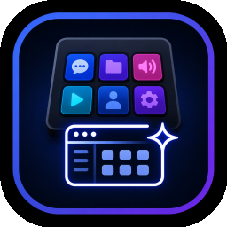

# Stream Deck GUI Enhancer

Tools to enhance the functionality of your Elgato Stream Deck Software

## Description
Missing some functionality in your Elgato Stream Deck Software? Like, want to move the Back Button of a folder from the upper left corner to somewhere else?
Or just use an Emoji as the icon, but Text Size can only be up to 18px?

All this and more can be achieved by altering values in the ``*.sdprofile`` files stored by the Elgato Software on your computer. Even if the Elgato GUI does not provide such functions, the backend Software does - so this project is meant to provide the tooling for doing so.

## Current Status
This project has just begun (as of 2026-06-02) and there is not much here right now.
A collection of single-function PowerShell Scripts shall be put together to provide an additional GUI that allows you to alter the device profile files used by the Elgato Stream Deck Software.

If you want to help me on understanding some file / registry structure and work on the project, I would be more than happy!

See the Issues section for a list of features I plan to implement and feel free to add your own ideas!

## Tested environments
This program is tested to work with at least:

- Windows 11 Pro 25H2
- Elgato Stream Deck 7.4.2
